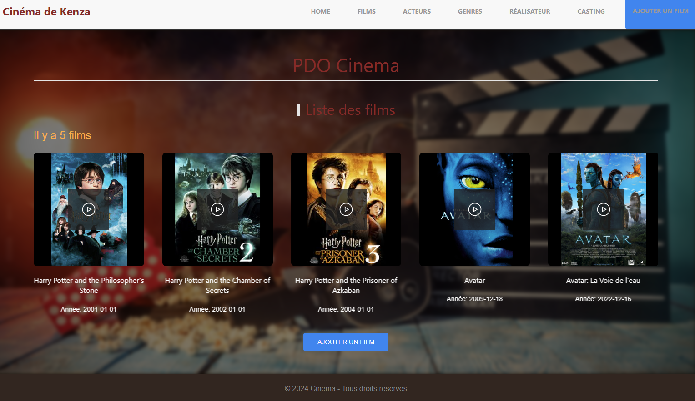
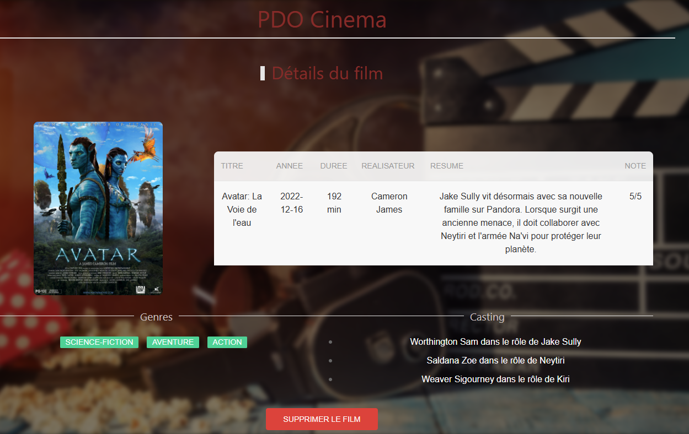
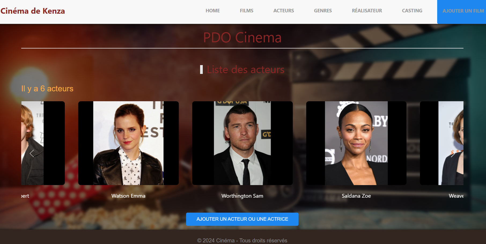
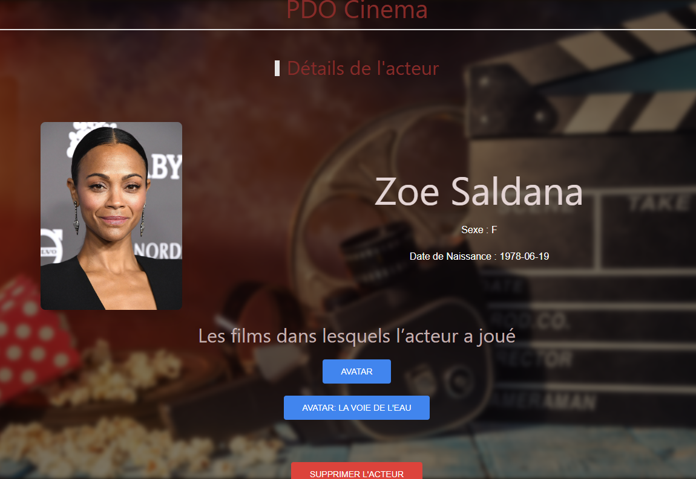
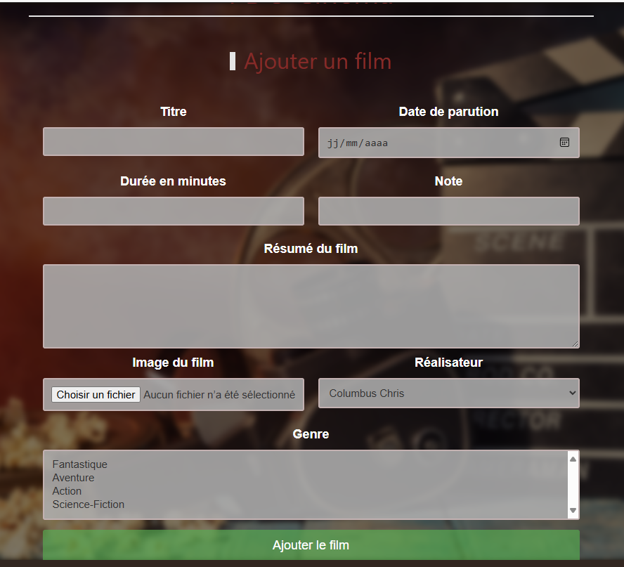

# Gestion de Films

## Description

Ce projet est une application web développée en PHP, destinée à gérer une base de données de films. L'application permet aux utilisateurs de gérer les acteurs, réalisateurs, genres, castings, et bien sûr, les films eux-mêmes. Chaque entité a sa propre interface de gestion pour ajouter, visualiser, et modifier les informations.

## Fonctionnalités

- **Gestion des Acteurs** : Ajouter, visualiser, et lister les acteurs.
- **Gestion des Réalisateurs** : Ajouter, visualiser, et lister les réalisateurs.
- **Gestion des Genres** : Ajouter, visualiser, et lister les genres.
- **Gestion des Castings** : Ajouter, visualiser, et lister les castings.
- **Gestion des Films** : Ajouter, visualiser, et lister les films.
- **Page d'accueil** : Une interface de démarrage permettant de naviguer entre les différentes sections de l'application.

## Technologies Utilisées

        

## Concepts Appris
Cet exercice nous a permis d'apprendre et de mettre en pratique plusieurs concepts fondamentaux du développement web :

- **Modèle MVC (Model-View-Controller)** : Structuration du projet en séparant les responsabilités entre le modèle (gestion des données), la vue (interface utilisateur), et le contrôleur (logique métier).
- **Gestion des bases de données avec PHP** : Interaction avec une base de données MySQL pour stocker et récupérer les informations sur les films, les acteurs, etc.
- **CRUD (Create, Read, Update, Delete)** : Implémentation des opérations de base pour gérer les ressources au sein de l'application.
- **Gestion des sessions et sécurisation des formulaires** : Concepts de base pour sécuriser l'application.
- **Utilisation de UIKit pour le design** : Création d'une interface utilisateur réactive et esthétique à l'aide du framework CSS UIKit.

## Aperçu Visuel
Voici quelques captures d'écran pour illustrer l'interface utilisateur de l'application :

### Liste des Films

### Détail d'un Film

    

### Liste des Acteurs

    

### Détail d'un Acteur

    

### Formulaire d'ajout de film

    

